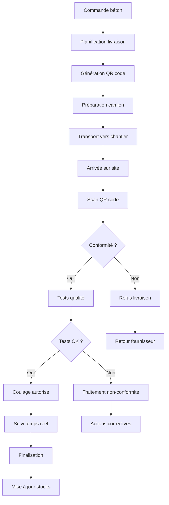
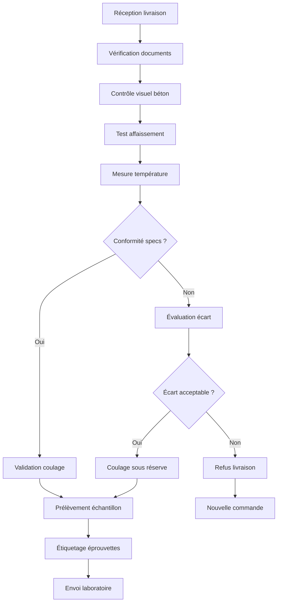
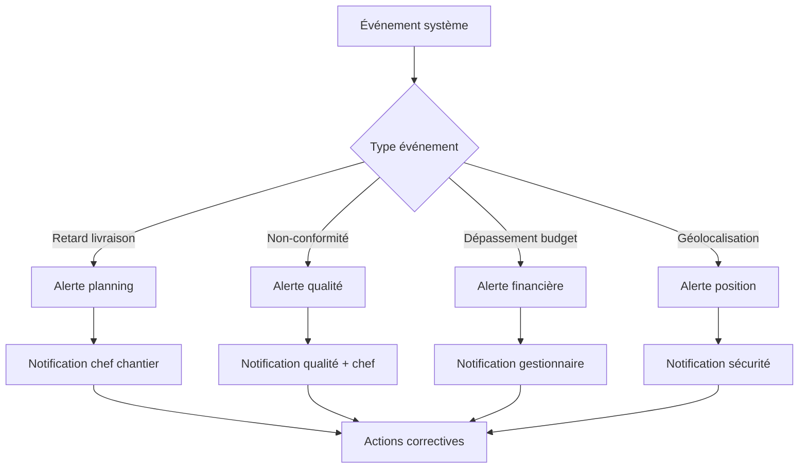
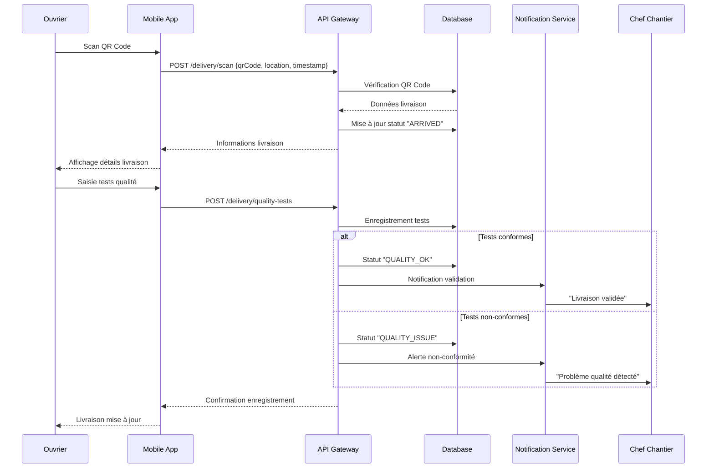
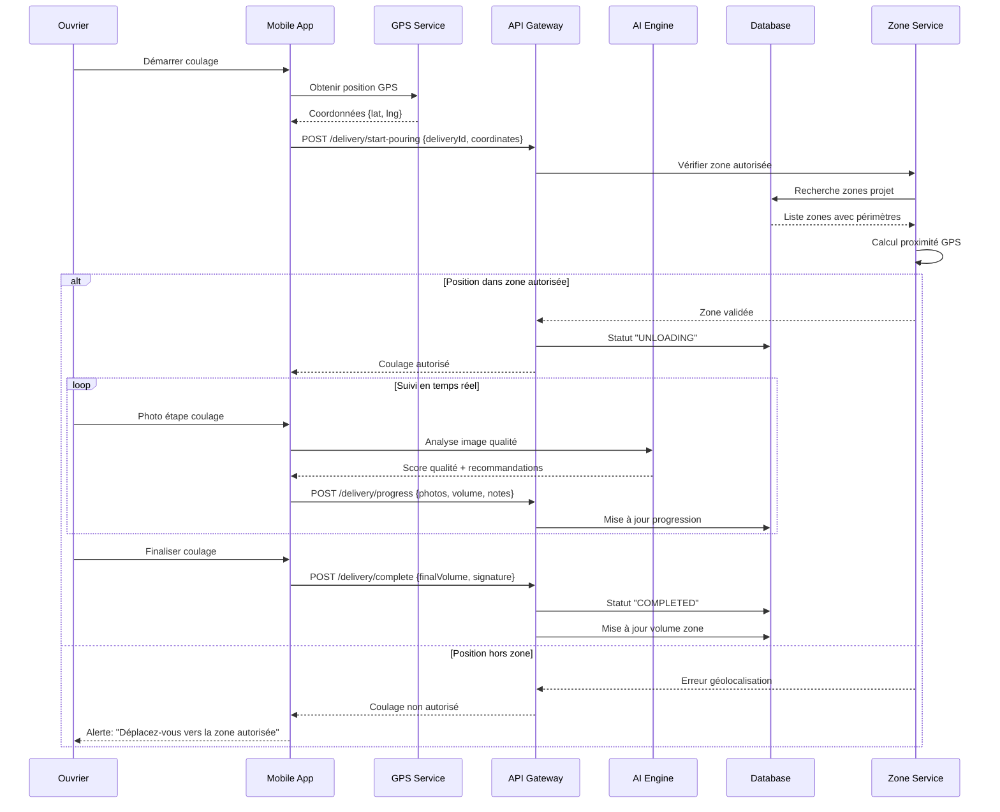
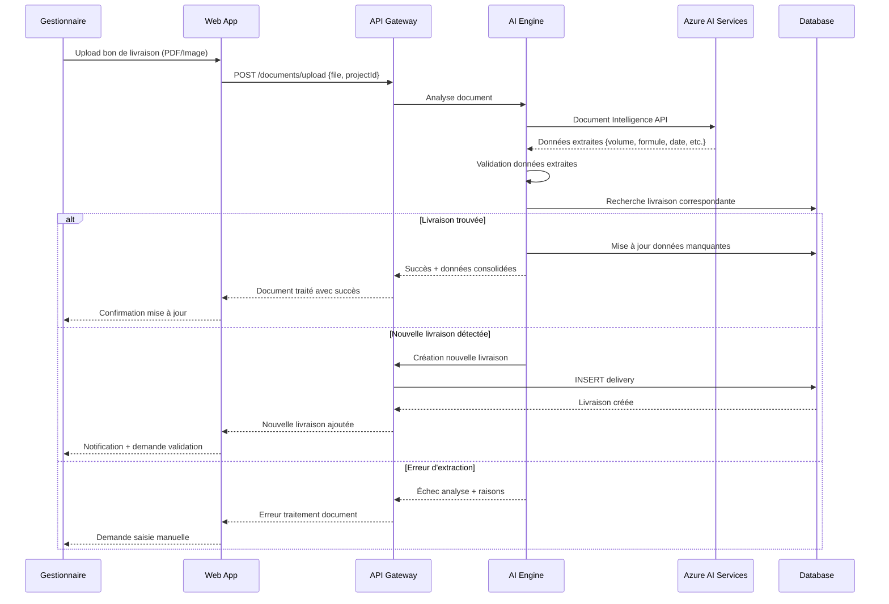
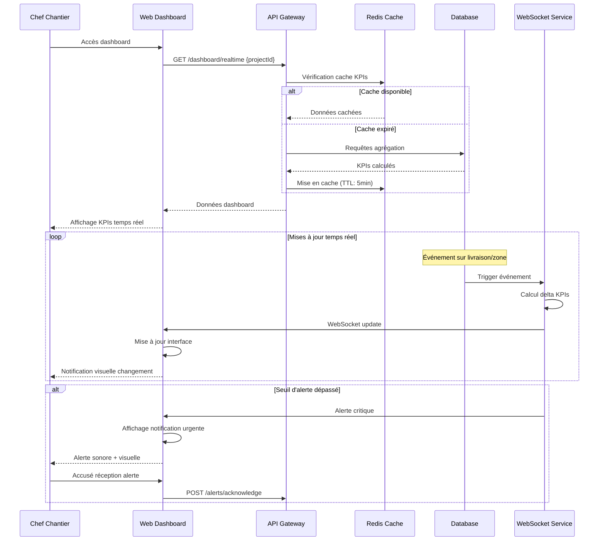

# Documentation Fonctionnelle - ScanBeton

## Vue d'ensemble

ScanBeton est une solution de gestion et suivi des livraisons de béton sur chantier, permettant un contrôle en temps réel de la qualité, des volumes et de la traçabilité des coulages.

## Personas et Rôles Utilisateurs

### 1. Chef de Chantier
- **Responsabilités** : Supervision générale, validation des livraisons, contrôle qualité
- **Accès** : Dashboard complet, gestion des zones, validation des anomalies
- **Outils** : Application mobile + interface web

### 2. Ouvrier/Conducteur de Travaux  
- **Responsabilités** : Scan des QR codes, saisie des données terrain, signalement d'anomalies
- **Accès** : Scan QR, saisie volumes, photos, géolocalisation
- **Outils** : Application mobile uniquement

### 3. Gestionnaire de Projet
- **Responsabilités** : Planification, budgets, reporting, analyse des KPIs
- **Accès** : Dashboard analytique, exports, configuration projet
- **Outils** : Interface web principalement

### 4. Chauffeur/Livreur
- **Responsabilités** : Transport, information temps réel, qualité du béton
- **Accès** : Consultation des informations de livraison
- **Outils** : QR codes physiques, communication mobile

## Parcours Utilisateurs Principaux

### Parcours 1 : Création et planification d'un projet

```
[Gestionnaire] → Création projet → Définition zones → Configuration formules → Planification livraisons
```

**Étapes détaillées :**
1. **Connexion et authentification**
   - Login sécurisé avec JWT
   - Sélection du rôle/contexte

2. **Création du projet**
   - Saisie informations client
   - Définition périmètre et budget
   - Upload des plans (analyse IA)

3. **Configuration des zones**
   - Découpage en zones de travail
   - Définition des volumes prévisionnels
   - Attribution des coordonnées GPS

4. **Sélection des formules**
   - Choix des types de béton par zone
   - Configuration des spécifications qualité
   - Validation des prix

5. **Planification des livraisons**
   - Calendrier prévisionnel
   - Génération des QR codes
   - Notification aux équipes

### Parcours 2 : Livraison et contrôle sur chantier

```
[Ouvrier] → Réception camion → Scan QR → Contrôles qualité → Validation coulage → Finalisation
```

**Étapes détaillées :**
1. **Préparation de la réception**
   - Consultation planning du jour
   - Vérification zone de coulage
   - Préparation matériel de contrôle

2. **Arrivée du camion**
   - Scan QR code de la livraison
   - Vérification correspondance commande
   - Contrôle visuel initial

3. **Tests qualité**
   - Mesure affaissement (slump test)
   - Contrôle température
   - Prélèvement échantillons si requis

4. **Validation et coulage**
   - Confirmation conformité
   - Géolocalisation du coulage
   - Photos avant/pendant/après

5. **Finalisation**
   - Saisie volume réel utilisé
   - Notes et observations
   - Signature électronique

### Parcours 3 : Suivi et pilotage du projet

```
[Chef de Chantier] → Dashboard → Analyse écarts → Actions correctives → Reporting
```

**Étapes détaillées :**
1. **Vue d'ensemble quotidienne**
   - Consultation dashboard temps réel
   - Alertes et notifications
   - Planning vs réalisé

2. **Analyse des performances**
   - KPIs par zone
   - Écarts budgétaires
   - Qualité et conformité

3. **Gestion des anomalies**
   - Investigation des écarts
   - Actions correctives
   - Communication équipes

4. **Reporting périodique**
   - Synthèses hebdomadaires
   - Exports pour client
   - Archivage documentation

## Processus Métiers Détaillés

### Processus 1 : Gestion du cycle de vie d'une livraison



### Processus 2 : Contrôle qualité et conformité



### Processus 3 : Gestion des alertes et notifications



## Diagrammes de Séquence

### Séquence 1 : Scan QR Code et validation livraison



### Séquence 2 : Processus de coulage avec géolocalisation



### Séquence 3 : Analyse IA de documents et mise à jour projet



### Séquence 4 : Dashboard temps réel et alertes



## Règles Métier et Validations

### Règles de validation des livraisons

1. **Contrôle temporel**
   - Livraison dans fenêtre planifiée ±30min
   - Temps de transport < temps max de la formule
   - Pas de livraison hors horaires chantier

2. **Contrôle géographique**
   - Position GPS dans rayon de 100m de la zone
   - Zone de coulage accessible et préparée
   - Respect des contraintes d'accès chantier

3. **Contrôle qualité**
   - Affaissement dans fourchette spécifiée
   - Température béton entre 5°C et 35°C
   - Conformité visuelle (pas de ségrégation)

4. **Contrôle quantitatif**
   - Volume livré ≤ volume commandé +5%
   - Volume zone ≤ volume prévu +10%
   - Budget consommé ≤ budget alloué

### Workflow des statuts

```
SCHEDULED → IN_TRANSIT → ARRIVED → UNLOADING → COMPLETED
     ↓           ↓          ↓          ↓          ↑
  CANCELLED  CANCELLED   REJECTED   REJECTED   COMPLETED
```

### Gestion des exceptions

1. **Retard de livraison** : Notification automatique + re-planification
2. **Non-conformité qualité** : Workflow d'escalade vers responsable qualité
3. **Dépassement volume** : Validation obligatoire chef de chantier
4. **Position incorrecte** : Blocage coulage + guidage GPS

## KPIs et Métriques Métier

### Indicateurs de performance

1. **Taux de conformité qualité** : % de livraisons conformes
2. **Respect des délais** : % de livraisons à l'heure
3. **Utilisation des volumes** : Volume réel / Volume prévu
4. **Efficacité coulage** : Temps moyen de déchargement
5. **Géolocalisation précise** : % de coulages dans la bonne zone

### Alertes automatiques

- **Retard > 30min** : Notification temps réel
- **Non-conformité qualité** : Alerte immédiate + escalade
- **Dépassement budget 90%** : Alerte préventive
- **Zone saturée** : Blocage nouvelles livraisons
- **Météo défavorable** : Recommandation report


# Architecture Technique - ScanBeton

## Schéma d'Architecture Technique Globale

```
┌─────────────────────────────────────────────────────────────────────────────────────┐
│                              SCANBETON - ARCHITECTURE TECHNIQUE                      │
└─────────────────────────────────────────────────────────────────────────────────────┘

┌─────────────────────────────────────────────────────────────────────────────────────┐
│                                   CLIENT LAYER                                      │
├─────────────────────────────────┬───────────────────────────────────────────────────┤
│        MOBILE APP               │            WEB DASHBOARD                          │
│   ┌─────────────────────────┐   │   ┌─────────────────────────────────────────────┐ │
│   │ Ionic 7.x + Angular 17 │   │   │          Angular 17 + PrimeNG              │ │
│   │ ├── QR Scanner          │   │   │ ├── Dashboard Analytics                    │ │
│   │ ├── GPS Tracking        │   │   │ ├── Project Management                     │ │
│   │ ├── Camera Integration  │   │   │ ├── Reporting & Export                     │ │
│   │ ├── Offline Support     │   │   │ └── Admin Configuration                    │ │
│   │ └── NGXS State Mgmt     │   │   └─────────────────────────────────────────────┘ │
│   └─────────────────────────┘   │                                                   │
│            │                    │                        │                          │
│         Capacitor               │                    HTTPS/WSS                      │
│            │                    │                        │                          │
└────────────┼────────────────────┴────────────────────────┼──────────────────────────┘
             │                                              │
             └──────────────────┬───────────────────────────┘
                                │
┌───────────────────────────────┼───────────────────────────────────────────────────────┐
│                          API GATEWAY LAYER                                           │
├───────────────────────────────┼───────────────────────────────────────────────────────┤
│                               │                                                       │
│   ┌─────────────────────────────────────────────────────────────────────────────┐   │
│   │                        AZURE LOAD BALANCER                                  │   │
│   │    ┌──────────────────┐    │    ┌──────────────────┐    │    ┌─────────────┐ │   │
│   │    │  Rate Limiting   │    │    │   SSL/TLS Term   │    │    │   WAF       │ │   │
│   │    └──────────────────┘    │    └──────────────────┘    │    └─────────────┘ │   │
│   └─────────────────────────────────────────────────────────────────────────────┘   │
│                                         │                                             │
└─────────────────────────────────────────┼─────────────────────────────────────────────┘
                                          │
┌─────────────────────────────────────────┼─────────────────────────────────────────────┐
│                            APPLICATION LAYER                                         │
├─────────────────────────────────────────┼─────────────────────────────────────────────┤
│                                         │                                             │
│   ┌─────────────────────────────────────────────────────────────────────────────┐   │
│   │                          NESTJS API BACKEND                                 │   │
│   │                                                                             │   │
│   │  ┌─────────────┐  ┌─────────────┐  ┌─────────────┐  ┌─────────────────────┐ │   │
│   │  │    AUTH     │  │  DELIVERY   │  │   PROJECT   │  │      AI ENGINE      │ │   │
│   │  │             │  │             │  │             │  │                     │ │   │
│   │  │ JWT Guards  │  │ QR Scanning │  │ Zone Mgmt   │  │ Document Analysis   │ │   │
│   │  │ RBAC        │  │ Validation  │  │ Planning    │  │ Quality Prediction  │ │   │
│   │  │ Sessions    │  │ Tracking    │  │ Budgeting   │  │ Image Recognition   │ │   │
│   │  └─────────────┘  └─────────────┘  └─────────────┘  └─────────────────────┘ │   │
│   │                                                                             │   │
│   │  ┌─────────────┐  ┌─────────────┐  ┌─────────────┐  ┌─────────────────────┐ │   │
│   │  │   FORMULA   │  │  DASHBOARD  │  │   COMMON    │  │     WEBSOCKETS      │ │   │
│   │  │             │  │             │  │             │  │                     │ │   │
│   │  │ Recipes     │  │ KPIs        │  │ Database    │  │ Real-time Updates   │ │   │
│   │  │ Pricing     │  │ Analytics   │  │ Cache       │  │ Notifications       │ │   │
│   │  │ Components  │  │ Reporting   │  │ Logging     │  │ Live Tracking       │ │   │
│   │  └─────────────┘  └─────────────┘  └─────────────┘  └─────────────────────┘ │   │
│   └─────────────────────────────────────────────────────────────────────────────┘   │
│                                         │                                             │
│   ┌─────────────────────────────────────┼─────────────────────────────────────────┐   │
│   │              API INTERFACES         │                                         │   │
│   │                                     │                                         │   │
│   │  ┌─────────────────────────────────────────────────────────────────────────┐ │   │
│   │  │  GraphQL API         │         REST API         │      WebSocket       │ │   │
│   │  │  ├── Queries         │         ├── CRUD Ops     │      ├── Live Data   │ │   │
│   │  │  ├── Mutations       │         ├── File Upload  │      ├── Push Notif  │ │   │
│   │  │  ├── Subscriptions   │         ├── Health       │      └── Chat/Alerts │ │   │
│   │  │  └── Schema Stitching│         └── Webhooks     │                      │ │   │
│   │  └─────────────────────────────────────────────────────────────────────────┘ │   │
│   └─────────────────────────────────────────────────────────────────────────────┘   │
└─────────────────────────────────────────┼─────────────────────────────────────────────┘
                                          │
┌─────────────────────────────────────────┼─────────────────────────────────────────────┐
│                               DATA LAYER                                             │
├─────────────────────────────────────────┼─────────────────────────────────────────────┤
│                                         │                                             │
│   ┌─────────────────────────────────────────────────────────────────────────────┐   │
│   │                              CACHE LAYER                                    │   │
│   │                                                                             │   │
│   │  ┌─────────────────────────────────────────────────────────────────────────┐ │   │
│   │  │                           REDIS CLUSTER                                 │ │   │
│   │  │                                                                         │ │   │
│   │  │ ┌─────────────┐ ┌─────────────┐ ┌─────────────┐ ┌─────────────────────┐ │ │   │
│   │  │ │  Sessions   │ │    KPIs     │ │   Temp      │ │    Real-time        │ │ │   │
│   │  │ │  JWT Cache  │ │  Dashboard  │ │   Files     │ │    Notifications    │ │ │   │
│   │  │ │  User Prefs │ │  Metrics    │ │   Uploads   │ │    WebSocket State  │ │ │   │
│   │  │ └─────────────┘ └─────────────┘ └─────────────┘ └─────────────────────┘ │ │   │
│   │  └─────────────────────────────────────────────────────────────────────────┘ │   │
│   └─────────────────────────────────────────────────────────────────────────────┘   │
│                                         │                                             │
│   ┌─────────────────────────────────────────────────────────────────────────────┐   │
│   │                           PRIMARY DATABASE                                  │   │
│   │                                                                             │   │
│   │  ┌─────────────────────────────────────────────────────────────────────────┐ │   │
│   │  │                      POSTGRESQL 15+ CLUSTER                             │ │   │
│   │  │                                                                         │ │   │
│   │  │ ┌─────────────┐ ┌─────────────┐ ┌─────────────┐ ┌─────────────────────┐ │ │   │
│   │  │ │   MASTER    │ │    SLAVE    │ │   BACKUP    │ │       SCHEMA        │ │ │   │
│   │  │ │             │ │             │ │             │ │                     │ │ │   │
│   │  │ │ Read/Write  │ │  Read Only  │ │  Point in   │ │ ├── Projects        │ │ │   │
│   │  │ │ ACID        │ │  Analytics  │ │  Time       │ │ ├── Zones           │ │ │   │
│   │  │ │ TypeORM     │ │  Reports    │ │  Recovery   │ │ ├── Deliveries      │ │ │   │
│   │  │ │             │ │             │ │             │ │ ├── Formulas        │ │ │   │
│   │  │ └─────────────┘ └─────────────┘ └─────────────┘ │ ├── Users           │ │ │   │
│   │  │                                                 │ └── Audit_Logs      │ │ │   │
│   │  │                                                 └─────────────────────┘ │ │   │
│   │  └─────────────────────────────────────────────────────────────────────────┘ │   │
│   └─────────────────────────────────────────────────────────────────────────────┘   │
└─────────────────────────────────────────┼─────────────────────────────────────────────┘
                                          │
┌─────────────────────────────────────────┼─────────────────────────────────────────────┐
│                            EXTERNAL SERVICES                                         │
├─────────────────────────────────────────┼─────────────────────────────────────────────┤
│                                         │                                             │
│   ┌─────────────────────────────────────────────────────────────────────────────┐   │
│   │                           AZURE AI SERVICES                                 │   │
│   │                                                                             │   │
│   │  ┌─────────────────────┐  ┌─────────────────────┐  ┌─────────────────────┐  │   │
│   │  │  Form Recognizer    │  │ Document Intelligence│  │  Computer Vision    │  │   │
│   │  │                     │  │                     │  │                     │  │   │
│   │  │ ├── PDF Analysis    │  │ ├── OCR Processing  │  │ ├── Image Quality   │  │   │
│   │  │ ├── Field Extract   │  │ ├── Layout Analysis │  │ ├── Defect Detection│  │   │
│   │  │ ├── Table Detection │  │ ├── Multi-language  │  │ ├── Color Analysis  │  │   │
│   │  │ └── Custom Models   │  │ └── Confidence Score│  │ └── Object Detection│  │   │
│   │  └─────────────────────┘  └─────────────────────┘  └─────────────────────┘  │   │
│   └─────────────────────────────────────────────────────────────────────────────┘   │
│                                                                                     │
│   ┌─────────────────────────────────────────────────────────────────────────────┐   │
│   │                          AZURE STORAGE SERVICES                             │   │
│   │                                                                             │   │
│   │  ┌─────────────────────┐  ┌─────────────────────┐  ┌─────────────────────┐  │   │
│   │  │   Blob Storage      │  │    File Storage     │  │   Table Storage     │  │   │
│   │  │                     │  │                     │  │                     │  │   │
│   │  │ ├── Documents       │  │ ├── Static Assets   │  │ ├── Logs Archive    │  │   │
│   │  │ ├── Images/Photos   │  │ ├── App Bundles     │  │ ├── Analytics Data  │  │   │
│   │  │ ├── Backup Files    │  │ ├── Reports Export  │  │ ├── Temp Data       │  │   │
│   │  │ └── CDN Integration │  │ └── Media Content   │  │ └── Session Store   │  │   │
│   │  └─────────────────────┘  └─────────────────────┘  └─────────────────────┘  │   │
│   └─────────────────────────────────────────────────────────────────────────────┘   │
│                                                                                     │
│   ┌─────────────────────────────────────────────────────────────────────────────┐   │
│   │                        NOTIFICATION SERVICES                                │   │
│   │                                                                             │   │
│   │  ┌─────────────────────┐  ┌─────────────────────┐  ┌─────────────────────┐  │   │
│   │  │   Push Notifications│  │    Email Service    │  │     SMS Service     │  │   │
│   │  │                     │  │                     │  │                     │  │   │
│   │  │ ├── FCM/APNS        │  │ ├── SendGrid/SMTP   │  │ ├── Twilio/Azure    │  │   │
│   │  │ ├── Real-time Alert │  │ ├── Templates       │  │ ├── Emergency Alert │  │   │
│   │  │ ├── Batch Messages  │  │ ├── Reports Delivery│  │ ├── OTP Verification│  │   │
│   │  │ └── User Preferences│  │ └── Newsletter      │  │ └── Status Updates  │  │   │
│   │  └─────────────────────┘  └─────────────────────┘  └─────────────────────┘  │   │
│   └─────────────────────────────────────────────────────────────────────────────┘   │
└─────────────────────────────────────────────────────────────────────────────────────┘

┌─────────────────────────────────────────────────────────────────────────────────────┐
│                              DEVOPS & INFRASTRUCTURE                                │
├─────────────────────────────────────────────────────────────────────────────────────┤
│                                                                                     │
│  ┌─────────────────────────────────────────────────────────────────────────────┐    │
│  │                             CI/CD PIPELINE                                  │    │
│  │                                                                             │    │
│  │ ┌─────────────┐ ┌─────────────┐ ┌─────────────┐ ┌─────────────────────────┐ │    │
│  │ │   SOURCE    │ │    BUILD    │ │    TEST     │ │        DEPLOY           │ │    │
│  │ │             │ │             │ │             │ │                         │ │    │
│  │ │ GitHub      │ │ NX Build    │ │ Unit Tests  │ │ ┌─────────────────────┐ │ │    │
│  │ │ Repo        │ │ Docker      │ │ E2E Tests   │ │ │ DEV Environment     │ │ │    │
│  │ │ Monorepo    │ │ Multi-stage │ │ SonarQube   │ │ │ (Auto Deploy)       │ │ │    │
│  │ │ NX Workspace│ │ Parallel    │ │ Coverage    │ │ └─────────────────────┘ │ │    │
│  │ │             │ │ Frontend +  │ │ Security    │ │ ┌─────────────────────┐ │ │    │
│  │ │             │ │ Backend     │ │ Scan        │ │ │ UAT Environment     │ │ │    │
│  │ │             │ │             │ │             │ │ │ (Auto Deploy)       │ │ │    │
│  │ │             │ │             │ │             │ │ └─────────────────────┘ │ │    │
│  │ │             │ │             │ │             │ │ ┌─────────────────────┐ │ │    │
│  │ │             │ │             │ │             │ │ │ PROD Environment    │ │ │    │
│  │ │             │ │             │ │             │ │ │ (Manual Deploy)     │ │ │    │
│  │ │             │ │             │ │             │ │ └─────────────────────┘ │ │    │
│  │ └─────────────┘ └─────────────┘ └─────────────┘ └─────────────────────────┘ │    │
│  └─────────────────────────────────────────────────────────────────────────────┘    │
│                                                                                     │
│  ┌─────────────────────────────────────────────────────────────────────────────┐    │
│  │                         MONITORING & OBSERVABILITY                          │    │
│  │                                                                             │    │
│  │ ┌─────────────┐ ┌─────────────┐ ┌─────────────┐ ┌─────────────────────────┐ │    │
│  │ │   LOGGING   │ │   METRICS   │ │   TRACING   │ │        ALERTING         │ │    │
│  │ │             │ │             │ │             │ │                         │ │    │
│  │ │ Structured  │ │ Custom KPIs │ │ Distributed │ │ ┌─────────────────────┐ │ │    │
│  │ │ JSON Logs   │ │ Perf Counters│ │ Request     │ │ │ Performance Alerts  │ │ │    │
│  │ │ Log Levels  │ │ Business    │ │ Tracking    │ │ │ Error Rate Alerts   │ │ │    │
│  │ │ Correlation │ │ Metrics     │ │ APM         │ │ │ Resource Alerts     │ │ │    │
│  │ │ IDs         │ │ System      │ │ Profiling   │ │ │ Business KPI Alerts │ │ │    │
│  │ │             │ │ Health      │ │             │ │ └─────────────────────┘ │ │    │
│  │ └─────────────┘ └─────────────┘ └─────────────┘ └─────────────────────────┘ │    │
│  └─────────────────────────────────────────────────────────────────────────────┘    │
└─────────────────────────────────────────────────────────────────────────────────────┘
```

## Vue d'ensemble

ScanBeton utilise une architecture **monorepo NX** avec séparation frontend mobile/backend API, déployée sur Azure avec une approche DevOps complète.

## Stack Technologique

### Frontend Mobile
- **Framework** : Ionic 7.x + Angular 17.x + Capacitor 5.x
- **State Management** : NGXS avec pattern Redux
- **Architecture** : Standalone Components + Lazy Loading
- **Features** : PWA, Offline-first, Camera/GPS, QR Scanner
- **Build** : TypeScript 5.x, RxJS 7.x, Webpack 5

### Backend API
- **Framework** : NestJS 10.x + Node.js 22.x
- **API** : GraphQL (primary) + REST (fallback)
- **Database** : PostgreSQL 15+ avec TypeORM 0.3.x
- **Cache** : Redis pour sessions et KPIs temps réel
- **AI** : Azure Form Recognizer + Document Intelligence

### Infrastructure & DevOps
- **Cloud** : Microsoft Azure (Web Apps, Storage, Container Registry)
- **Containers** : Docker multi-stage builds
- **CI/CD** : GitHub Actions avec workflow templates
- **Monitoring** : SonarQube, Health checks, Structured logging
- **Security** : JWT, RBAC, Rate limiting, HTTPS

## Architecture Backend

### Structure Modulaire NestJS
```
scanbeton-api/
├── auth/              # JWT, Guards, Strategies
├── delivery/          # Gestion livraisons + QR scanning
├── project/           # Projets et zones de travail  
├── formula/           # Recettes béton et prix
├── ai-engine/         # Azure AI + analyse documents
├── dashboard/         # KPIs et métriques temps réel
└── common/            # Database, Cache, Interceptors
```

### Base de Données
- **ORM** : TypeORM avec migrations automatisées
- **Relations** : Project → Zones → Deliveries → Formulas
- **Performance** : Index optimisés, requêtes paginées
- **Backup** : Point-in-time recovery Azure
- **Scaling** : Connection pooling, read replicas prêtes

### Cache et Performance
- **Redis** : Cache KPIs (TTL 5min), sessions utilisateur
- **Stratégie** : Cache-aside pattern avec invalidation intelligente
- **Compression** : Gzip sur API responses
- **Rate Limiting** : Throttling adaptatif par utilisateur/IP

## Architecture Frontend

### Structure Modulaire Angular
```
scanbeton-mobile/
├── core/              # Singletons (Auth, API, Storage)
├── shared/            # Composants/pipes réutilisables
├── features/          # Modules métier standalone
│   ├── dashboard/     # Tableaux de bord temps réel
│   ├── scan/          # QR Scanner + géolocalisation
│   ├── deliveries/    # CRUD livraisons
│   └── projects/      # Gestion projets/zones
└── pages/             # Shell pages avec routing
```

### État Application (NGXS)
- **States** : Delivery, Project, Zone, Auth, UI
- **Pattern** : Actions → Effects → State → Selectors
- **Persistence** : Local storage + sync différée
- **Offline** : Queue actions, sync automatique online

### Capacités Mobiles
- **Camera** : Scan QR codes + photos qualité
- **GPS** : Géolocalisation précise des coulages
- **Storage** : SQLite local + sync cloud
- **Push** : Notifications temps réel via FCM
- **Offline** : Service Worker + données cached

## Intégrations Externes

### Azure AI Services
- **Form Recognizer** : Extraction données bons de livraison
- **Document Intelligence** : OCR multi-format (PDF, images)
- **Confidence Scoring** : Validation automatique vs manuelle
- **Custom Models** : Entraînement sur docs spécifiques béton

### Géolocalisation
- **GPS Natif** : Capacitor Geolocation plugin
- **Validation Zones** : Algorithme proximité avec rayons configurables  
- **Offline Maps** : Cache tiles essentielles
- **Tracking** : Historique positions pour audit

## Déploiement et Infrastructure

### Containerisation Docker
- **Multi-stage builds** : Optimisation taille images
- **Security** : Non-root users, minimal base images
- **Health checks** : Endpoints dédiés liveness/readiness
- **Resource limits** : CPU/Memory configurables

### Pipeline CI/CD
- **GitHub Actions** : Workflows parallèles frontend/backend
- **Quality Gates** : Tests, coverage, SonarQube obligatoires
- **Environments** : Dev (auto) → UAT (auto) → Prod (manuel)
- **Rollback** : Blue-green deployment avec slot swapping

### Monitoring et Observabilité  
- **Logging** : Structured JSON logs avec corrélation IDs
- **Metrics** : Custom metrics applicatifs + infrastructure
- **Alerting** : Seuils configurés sur KPIs métier
- **Tracing** : APM pour performance API calls

## Sécurité

### Authentification & Autorisation
- **JWT** : Tokens avec refresh automatique
- **RBAC** : Rôles granulaires (Admin, Chef, Ouvrier, Lecteur)
- **MFA** : Support 2FA pour comptes sensibles
- **Session Management** : Timeout configurables, logout forcé

### Protection Données
- **Encryption** : TLS 1.3 transit, AES-256 repos
- **Validation** : Input sanitization, SQL injection protection  
- **CORS** : Origins whitelistées par environnement
- **Headers** : Security headers complets (HSTS, CSP, etc.)

### Audit et Compliance
- **Logs Audit** : Traçabilité complète actions utilisateur
- **Data Retention** : Policies configurables par type donnée
- **GDPR** : Soft delete, export données, droit oubli
- **Backup** : Chiffrement, retention 7/30/365 jours

## Performance et Scalabilité

### Frontend Optimisations
- **Bundle Splitting** : Lazy loading modules par feature
- **Change Detection** : OnPush strategy généralisée
- **PWA** : Service workers, app shell caching
- **Image Optimization** : WebP, lazy loading, compression

### Backend Scalabilité
- **Horizontal Scaling** : Stateless design, load balancer ready
- **Database** : Connection pooling, query optimization
- **Caching** : Multi-level (Redis, HTTP, CDN)
- **API** : Pagination, field selection, batch operations

### Monitoring Performance
- **Frontend** : Core Web Vitals, runtime performance
- **Backend** : Response times, throughput, error rates  
- **Database** : Query performance, connection usage
- **Infrastructure** : CPU, memory, disk, network metrics

## Évolution et Maintenance

### Architecture Evolutive
- **Microservices Ready** : Modules découplés, APIs bien définies
- **Event Sourcing** : Préparation audit trail complet
- **Multi-tenant** : Base architecture pour SaaS futur
- **API Versioning** : Stratégie backward compatibility

### Outils Développement
- **NX Monorepo** : Build cache, dependency graph
- **Code Quality** : ESLint, Prettier, Husky pre-commit
- **Testing** : Unit, integration, E2E avec Cypress
- **Documentation** : Auto-generated API
